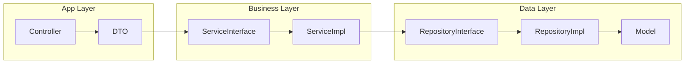

# 🛠️ Laravel Smart Dev Kit

[](https://laravel.com)
[](https://php.net)
[](https://laravel.com/docs/sail)
[](LICENSE)

**Laravel Smart Dev Kit** is a professional, production-ready starter kit designed for high-speed API development. It comes pre-configured with a powerful SDK (`muhammad/easy-dev`) that automates architecture generation, allowing you to focus on business logic.

---

## 🏛️ Technical Stack

- **Framework**: Laravel 12+ (PHP 8.3)
- **Auth**: JWT (Stateless) & Spatie Permissions (RBAC)
- **Architecture**: Modular (nwidart/laravel-modules) + Clean Architecture (Service-Repository)
- **Data Handling**: Spatie Data (DTOs) & Spatie Query Builder
- **Automation**: Easy Dev SDK for CRUD and Relationship generation
- **Dev Environment**: Docker via Laravel Sail (includes Horizon & Scheduler)

---

## 🏗️ Folder Structure

This project follows a strict multi-layered architecture:



---

## 🚀 Quick Start

### 1. Clone & Setup
```bash
git clone https://github.com/MohammedTaha187/Laravel-Smart-Dev-Kit.git
cd Laravel-Smart-Dev-Kit
composer install
cp .env.example .env
php artisan key:generate
php artisan jwt:secret
```

### 2. Start Environment
```bash
./vendor/bin/sail up -d
./vendor/bin/sail artisan migrate --seed
```

---

## 🪄 Smart Development Workflow

### Generate a Complete Feature
```bash
./vendor/bin/sail artisan smart:crud Product --module=Inventory
```
This single command generates the **Model, Migration, Controller, DTO, Service (Interface & Impl), Repository (Interface & Impl), Policy, and Pest Test**.

### Sync Database Relationships
```bash
./vendor/bin/sail artisan smart:sync-relations
```

---

## 🧪 Testing
We use **Pest** for all testing. Every generated feature includes an automated test suite.

```bash
./vendor/bin/sail artisan test
```

---

## 👨‍💻 Author
**Muhammad Taha**  
*Backend Developer*

---
*Built for speed, stability, and clean code.*
