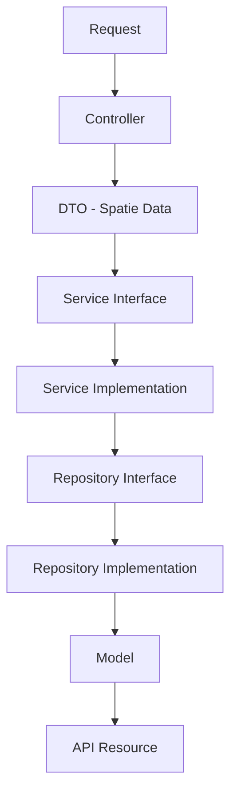

# 🚀 Easy Dev SDK for Laravel

[](https://packagist.org/packages/muhammad/easy-dev)
[](https://packagist.org/packages/muhammad/easy-dev)
[](https://packagist.org/packages/muhammad/easy-dev)
[](https://php.net)
[](https://laravel.com)

**Easy Dev SDK** is a powerful, automation-focused toolkit designed to accelerate Laravel API development by 10x. It eliminates boilerplate by generating high-quality, production-ready code structures following strict Clean Architecture principles.

---

## 🏗️ Architecture Flow

The SDK enforces a professional multi-layered architecture for every feature:



---

## 🚀 Key Features

- **Standardized CRUD Generation**: Generate Model, Migration, Controller, DTO, Service, Repository, Policy, and Pest tests in one command.
- **Modern Model Standards**: Uses Laravel 13 `#[Guarded]` attributes and PHPDoc-based factory discovery.
- **Smart UUID Support**: Automatically detects UUID primary keys and configures `HasUuids` traits and string type-hinting.
- **Smart Validation**: Automatically detects database column types and generates validation rules.
- **Automated Relationship Discovery**: Scans DB constraints to write `belongsTo` and `hasMany` methods automatically.
- **Modular Support**: Full integration with `nwidart/laravel-modules`.

---

## ✨ Recent Updates (v2.0)

- **Laravel 13 & PHP 8.4 Ready**: Full support for the latest framework features.
- **Mass Assignment Refactor**: Replaced `$fillable` with `#[Guarded(['id', ...])]` attribute.
- **Factory Discovery**: Removed `newFactory()` boilerplate; uses modern `@use HasFactory<ModelFactory>` pattern.
- **Global ID Type-Hinting**: Automatic switching between `int` and `string` for Service/Repository methods based on PK.

---

## 🛠️ Installation

```bash
composer require muhammad/easy-dev --dev
```

Publish the configuration and stubs:

```bash
php artisan vendor:publish --tag="easy-dev-config"
php artisan vendor:publish --tag="easy-dev-stubs"
```

---

## 📖 Usage

### 1. Generate a Professional CRUD
Generate a complete feature set for a "Product" model (and create a migration):

```bash
php artisan smart:crud Product --module=Ecommerce
```

### 2. Generate from Existing Migration
Build an entire feature based on an existing database table (Auto-detects columns and relationships):

```bash
php artisan smart:from-migration products
```

### 3. Sync Relationships
Automatically detect database relationships for ALL existing models:

```bash
php artisan smart:sync-relations
```

---

## 🧪 Testing

The SDK is built with **Pest** in mind. Every generated feature comes with a comprehensive Pest test suite ready to run:

```bash
php artisan test
```

---

## 👨‍💻 Author

**Muhammad Taha**  
*Backend Developer & Cloud Architect*

---
*Built with ❤️ for the Laravel Community.*
