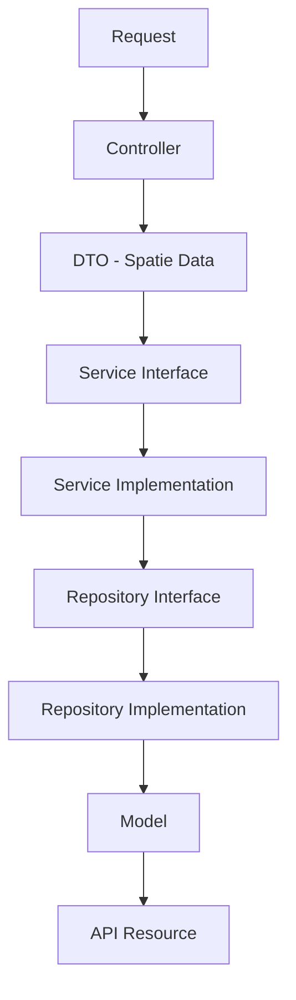

# 🚀 Easy Dev SDK for Laravel

[](https://packagist.org/packages/muhammad/easy-dev)
[](https://packagist.org/packages/muhammad/easy-dev)
[](https://packagist.org/packages/muhammad/easy-dev)
[](https://php.net)
[](https://laravel.com)

**Easy Dev SDK** is a powerful, automation-focused toolkit designed to accelerate Laravel API development by 10x. It eliminates boilerplate by generating high-quality, production-ready code structures following strict Clean Architecture principles.

---

## 🏗️ Architecture Flow

The SDK enforces a professional multi-layered architecture for every feature:


```mermaid
graph TD
    A[Request] --> B[Controller]
    B --> C[DTO - Spatie Data]
    C --> D[Service Interface]
    D --> E[Service Implementation]
    E --> F[Repository Interface]
    F --> G[Repository Implementation]
    G --> H[Model]
    H --> I[API Resource]
```

---

## 🚀 Key Features

- **Standardized CRUD Generation**: Generate Model, Migration, Controller, DTO, Service, Repository, Policy, and Pest tests in one command.
- **Modern Model Standards**: Uses Laravel 13 `#[Guarded]` attributes and PHPDoc-based factory discovery.
- **Smart UUID Support**: Automatically detects UUID primary keys and configures `HasUuids` traits and string type-hinting.
- **Smart Validation**: Automatically detects database column types and generates validation rules.
- **Automated Relationship Discovery**: Scans DB constraints to write `belongsTo` and `hasMany` methods automatically.
- **Modular Support**: Full integration with `nwidart/laravel-modules`.

---

## ✨ Recent Updates (v2.0)

- **Laravel 13 & PHP 8.4 Ready**: Full support for the latest framework features.
- **Mass Assignment Refactor**: Replaced `$fillable` with `#[Guarded(['id', ...])]` attribute.
- **Factory Discovery**: Removed `newFactory()` boilerplate; uses modern `@use HasFactory<ModelFactory>` pattern.
- **Global ID Type-Hinting**: Automatic switching between `int` and `string` for Service/Repository methods based on PK.
- **Modular Database Support**: Database migrations and factories are now generated inside the module directory (`Modules/{Module}/database/migrations` and `Modules/{Module}/Database/Factories`) instead of global paths. Custom `newFactory()` resolves the custom namespace seamlessly.

---

## 🚀 Getting Started & Local Setup

If you are downloading this repository for the first time, follow these steps to set up your local development environment:

### 1. Run the Automated Setup
The project includes a pre-configured Composer script that installs all dependencies (PHP & NPM), copies the environment configuration, generates the app key, runs database migrations, and builds assets automatically:
```bash
composer run setup
```

### 2. Manual Setup (Alternative)
If you prefer to run the setup steps manually:
```bash
# Install PHP dependencies
composer install

# Set up the environment file
cp .env.example .env

# Generate application key
php artisan key:generate

# Run database migrations
php artisan migrate

# Install Node dependencies and build assets
npm install
npm run build
```

### 3. Run the Development Server
To launch the development server, run:
```bash
npm run dev
```

---

## 🛠️ Installation

```bash
composer require muhammad/easy-dev --dev
```

Publish the configuration and stubs:

```bash
php artisan vendor:publish --tag="easy-dev-config"
php artisan vendor:publish --tag="easy-dev-stubs"
```

---

## 📖 Usage

### 1. Generate a Professional CRUD
Generate a complete feature set for a "Product" model (and create a migration):

```bash
php artisan smart:crud Product --module=Ecommerce
```

### 2. Generate from Existing Migration
Build an entire feature based on an existing database table (Auto-detects columns and relationships):

```bash
php artisan smart:from-migration products
```

### 3. Sync Relationships
Automatically detect database relationships for ALL existing models:

```bash
php artisan smart:sync-relations
```

---

### 💡 Complete Walkthrough: Generating a Module Feature (e.g., Product)

If you want to create a new `Product` feature inside an `Ecommerce` module:

#### Step 1: Generate the CRUD Scaffold
Run the generator to create all layers including the model and migration inside the module:
```bash
php artisan smart:crud Product --module=Ecommerce
```
This generates the migration file inside the module directory:
`Modules/Ecommerce/database/migrations/xxxx_xx_xx_xxxxxx_create_products_table.php`

#### Step 2: Define your Database Schema
Open the generated migration file and define your columns, for example:
```php
Schema::create('products', function (Blueprint $table) {
    $table->id();
    $table->string('name');
    $table->text('description')->nullable();
    $table->decimal('price', 10, 2);
    $table->integer('stock_qty')->default(0);
    $table->timestamps();
});
```

#### Step 3: Run the Migration
Run the standard Laravel migration command (the module's ServiceProvider registers migration loading automatically):
```bash
php artisan migrate
```

#### Step 4: Re-Generate from Database Schema (Smart Scan)
To automatically update your Requests validation rules, Spatie DTO properties, and Model relationships from your database columns, run:
```bash
php artisan smart:from-migration products --module=Ecommerce --force
```
This scans the active database schema and rebuilds all classes with precise types and validation rules!

---

## 🧪 Testing

The SDK is built with **Pest** in mind. Every generated feature comes with a comprehensive Pest test suite ready to run:

```bash
php artisan test
```

---

## 👨‍💻 Author

**Muhammad Taha**  
*Backend Developer & Cloud Architect*

---
*Built with ❤️ for the Laravel Community.*
