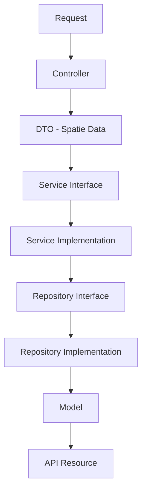

# 🚀 Easy Dev SDK for Laravel

[](https://packagist.org/packages/muhammad/easy-dev)
[](https://packagist.org/packages/muhammad/easy-dev)
[](https://packagist.org/packages/muhammad/easy-dev)
[](https://php.net)
[](https://laravel.com)

**Easy Dev SDK** is a powerful, automation-focused toolkit designed to accelerate Laravel API development by 10x. It eliminates boilerplate by generating high-quality, production-ready code structures following strict Clean Architecture principles.

---

## 🏗️ Architecture Flow

The SDK enforces a professional multi-layered architecture for every feature:



---

## 🚀 Key Features

- **Smart CRUD Generation**: Generate Model, Migration, Controller, DTO, Service, Repository, Policy, and Pest tests in one command.
- **Smart Validation**: Automatically detects database column types and generates validation rules.
- **Relationship Discovery**: Detects foreign keys and writes relationships into your Models automatically.
- **Modular Support**: Full integration with `nwidart/laravel-modules`.
- **Stateless API**: Optimized for JWT-based authentication.

---

## 🛠️ Installation

```bash
composer require muhammad/easy-dev --dev
```

Publish the configuration and stubs:

```bash
php artisan vendor:publish --tag="easy-dev-config"
php artisan vendor:publish --tag="easy-dev-stubs"
```

---

## 📖 Usage

### 1. Generate a Professional CRUD
Generate a complete feature set for a "Product" model:

```bash
php artisan smart:crud Product --module=Ecommerce
```

**What happens?** 12 files are generated following the strict Interface-Service-Repository flow!

### 2. Sync Relationships
Automatically detect database relationships and update your models:

```bash
php artisan smart:sync-relations
```

### 3. Generate from Migration
Build a entire feature based on an existing database table:

```bash
php artisan smart:from-migration products
```

---

## 🧪 Testing

The SDK is built with **Pest** in mind. Every generated feature comes with a comprehensive Pest test suite ready to run:

```bash
php artisan test
```

---

## 👨‍💻 Author

**Muhammad Taha**  
*Backend Developer & Cloud Architect*

---
*Built with ❤️ for the Laravel Community.*
